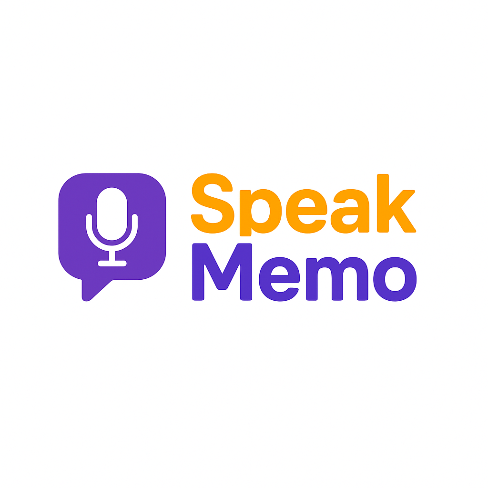

# 🗣️ SpeakMemo

**SpeakMemo** é uma aplicação que permite agendar e reproduzir interações em inglês via áudio, usando fluxos automatizados com o n8n. É ideal para quem está aprendendo inglês e deseja praticar de forma passiva e contínua ao longo do dia.

<p align="center">
  
</p>

---

## ✨ Funcionalidades

* ⏰ Agendamento de mensagens via n8n (ex: "Good morning, Diego")
* 🗣️ Geração de voz automática com Kokoro TTS
* ☁️ Armazenamento dos áudios em bucket MinIO (S3)
* 🐇 Publicação de metadados na fila RabbitMQ
* 🎷 Reprodução automática no navegador via WebSocket
* 🧹 Auto delete do áudio após reprodução
* 📈 Histórico e estatísticas de interações em tempo real

---

## ⚒️ Instalação

### Requisitos

* Docker e Docker Compose
* Acesso a um ambiente com:

  * MinIO
  * RabbitMQ
  * Serviço Kokoro TTS

### Passos

```bash
git clone https://github.com/seu-usuario/speakmemo.git
cd speakmemo
cp .env.example .env  # edite com suas configurações
docker compose up -d --build
```

---

## 📂 Estrutura do Projeto

```
app/
├── public/               # Frontend estático com reprodutor
│   ├── index.html
│   ├── style.css
│   └── favicon.ico
├── server.js             # Backend Express + WebSocket + RabbitMQ
├── speakmemo-history.json
n8n-projects/             # Fluxos n8n exportados (.json)
.env                      # Variáveis de ambiente
docker-compose.yml        # Orquestra backend + dependências
```

---

## 🥚 Exemplo de Uso

1. O fluxo `speak-memo-v1` no n8n é acionado às 9:03
2. Ele gera o texto "Hello Diego, good morning!"
3. O Kokoro cria o áudio e envia para o MinIO
4. Um evento é publicado na fila `00_speak_memo_audio_process_play`
5. O site detecta o evento via WebSocket, baixa e reproduz o som
6. Após a reprodução, o áudio é deletado automaticamente

---

## 📦 Tecnologias Utilizadas

* Node.js + Express
* WebSocket (nativo)
* AWS SDK (para integração com MinIO)
* RabbitMQ (mensageria)
* n8n (automacao)
* Kokoro TTS (síntese de voz)
* HTML/CSS puro no frontend

---

## 🐳 Executando com Docker

### Usando Docker Compose (recomendado)

```bash
docker-compose up -d --build
```

### Usando Docker diretamente

```bash
docker build -t speakmemo-app .

docker run -d --name speakmemo \
  -p 3000:3000 \
  --env-file .env \
  speakmemo-app
```

> Certifique-se de que o arquivo `.env` esteja corretamente configurado com as variáveis de MinIO, RabbitMQ e porta do app.

---

## 📊 Métricas de Interação

O histórico de interações exibe estatísticas detalhadas organizadas em três categorias principais:

### 🔠 Por Tipo (`type`)

Classifica o propósito da mensagem:

* `greeting` → Cumprimentos (ex: Good morning, Hello)
* `question` → Qualquer tipo de pergunta
* `affirmation` → Afirmações úteis (ex: I am Diego, I am DevOps)
* `repetition` → Frases para treino/repetição

### 🌅 Por Contexto (`context`)

Contextualiza quando ou em que situação aquela frase é usada:

* `morning`, `evening`, `interview`, `travel`, `restaurant` etc.

### 🔁 Por Rotina (`routine`)

Indica de qual fluxo de automação n8n aquela interação veio:

* `daily-routine`
* `practice`
* `preferences`
* `asking` → Qualquer tipo de pergunta

---

## 🔮 Melhorias Futuras

* [ ] Reconhecimento de voz e resposta automática
* [ ] Histórico categorizado por tema (saudação, apresentação, perguntas)
* [ ] Interface para editar agendamentos via frontend
* [ ] Player com controle de velocidade e repetição

---

## 📄 Licença

Este projeto é de código aberto. Você pode utilizar, modificar e distribuir conforme desejar, respeitando os princípios do software livre.
